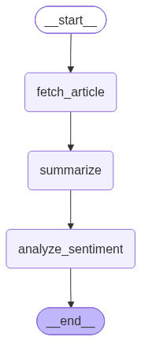

# 📰 News Intelligence Agent

A LangGraph-based AI workflow for automated news
summarization and sentiment analysis using Google Gemini.


## Overview

News Intelligence Agent analyzes news articles provided either
as a URL or raw text.

The workflow:

1. Fetches and extracts article content using a tool.
2. Generates a concise summary using Google Gemini.
3. Performs sentiment analysis using a dedicated VADER tool.
4. Returns a structured analysis containing the summary,
   sentiment, and sentiment score.

## Architecture



### Workflow

START
↓
Fetch Article
↓
Summarize with Gemini
↓
Analyze Sentiment
↓
END

## Key Engineering Concepts

- **LangGraph orchestration** — models the analysis pipeline
  as a stateful graph of independent nodes.
- **Shared state** — passes article content, summary, and
  sentiment information between graph nodes.
- **Tool integration** — news extraction and sentiment
  analysis are implemented as reusable tools.
- **LLM integration** — Google Gemini is used for factual
  news summarization.
- **Structured output** — Pydantic models define the expected
  analysis response.
- **Separation of concerns** — fetching, summarization, and
  sentiment analysis are isolated into separate modules.
- **Testing** — core functionality is covered using pytest.

## Tech Stack

| Category | Technology |
|---|---|
| Language | Python |
| Agent orchestration | LangGraph |
| LLM framework | LangChain |
| LLM | Google Gemini |
| Web extraction | Requests + BeautifulSoup |
| Sentiment analysis | VADER |
| Data validation | Pydantic |
| Testing | Pytest |

## Features

- URL-based news extraction
- Raw article text support
- LLM-powered summarization
- Tool-based sentiment analysis
- Structured output
- Error handling
- Automated tests
- LangGraph workflow visualization

## Project Structure

```text
news-sentiment-agent/
├── news_agent/
│   ├── nodes/
│   ├── tools/
│   ├── graph.py
│   ├── state.py
│   └── models.py
├── tests/
├── examples/
├── main.py
├── visualize_graph.py
├── langgraph.png
├── requirements.txt
└── README.md
```

## Example

### Input

```text
A major technology company announced a new investment
in India, creating thousands of new jobs and expanding
its cloud infrastructure.
```

### Output

{
  "summary": "The technology company announced a major
  investment in India that will expand its cloud
  infrastructure and create thousands of jobs.",
  "sentiment": "positive",
  "sentiment_score": 0.72
}

## Testing

Run the test suite with:

```bash
python -m pytest
```

## Future Improvements

- Support additional news extraction strategies for
  JavaScript-rendered websites.
- Add article metadata extraction.
- Add confidence estimation.
- Add a web interface.
- Support multiple LLM providers.
- Add persistent analysis history.
- Add observability and tracing.

## Limitations

- Some news websites may block automated requests.
- JavaScript-rendered pages may not expose article content
  through a simple HTTP request.
- VADER is a lightweight lexicon-based sentiment analyzer
  and may not capture complex context or sarcasm.
- LLM-generated summaries depend on the quality and length
  of the extracted article content.
